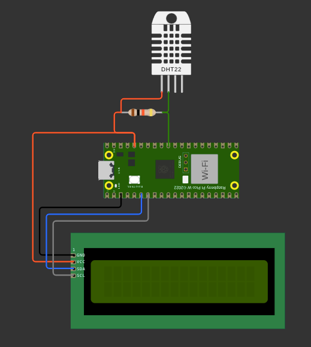

# Leitor de Temperatura e Umidade com DHT22 no Raspberry Pi Pico

Este projeto realiza a leitura de temperatura e umidade usando o sensor **DHT22** conectado ao **Raspberry Pi Pico**. Os dados são exibidos em um **display LCD** e também enviados via terminal serial.

##  Requisitos

* Raspberry Pi Pico
* Sensor DHT22
* Display LCD (I2C)
* Fios jumper
* Biblioteca `pico-sdk`
* Biblioteca personalizada `lcd.h` - https://github.com/raspberrypi/pico-examples/tree/develop/i2c/lcd_1602_i2c

##  Estrutura

* `SensorDHT22.c`: Código principal contendo a lógica de leitura do DHT22 e exibição no LCD.
* `lcd.h`: Biblioteca de controle do display LCD.

##  Como Funciona

- **`measure_pulse()`**
    Captura o tempo de pulso do sensor

- **`send_initial_pulse()`**
    Envia um pulso para iniciar a comunicação com o sensor

- **`read_data_dht22()`**
    Realiza a leitura com 40 bits de dados (2 bits para umidade, 2 bits para temperatua e 1 para checar a soma)
    
- **`concatenate_temperature`**
    Realiza a concatenação de temperatura para a exibição no display

- **`concatenate_umidity()`**
    Realiza a concatenação de umidate para exibição no display

##  Exemplo de Saída no Terminal

DADOS SALVOS!!! 
Temperatura: 49.40 º | Umidade: 33.00 % 

## Conexões

### Sensor DHT22

| Pino DHT22 | Função        | Conectar ao Pico |
| ---------- | ------------- | ---------------- |
| 1 (VCC)    | Alimentação   | 3.3V             |
| 2 (SDA)    | Dados         | GPIO 26          |
| 3 (NC)     | Não conectado | —                |
| 4 (GND)    | Terra         | GND              |

> **Observação:** Utilize um resistor pull-up de 10kΩ entre VCC e SDA.

### Display LCD (I2C)

> Preencha os detalhes de conexão conforme seu modelo de display LCD:

| Pino LCD | Função      | Conectar ao Pico    |
| -------- | ----------- | ------------------- |
| VCC      | Alimentação | 3.3V ou 5V          |
| GND      | Terra       | GND                 |
| SDA      | Dados I2C   | GPIO 4              |
| SCL      | Clock I2C   | GPIO 5              |

